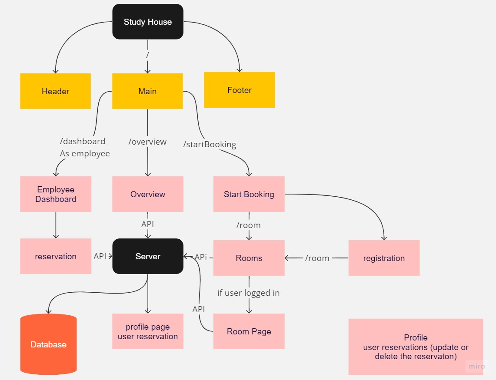
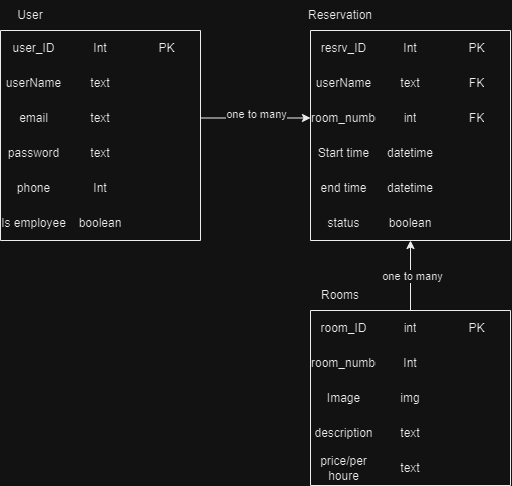
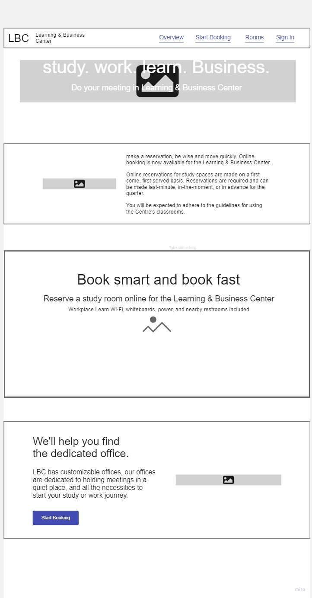
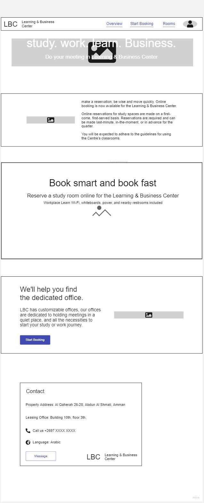
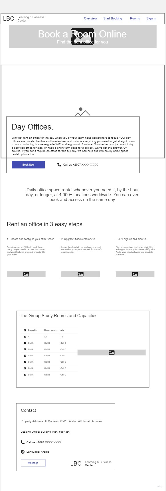
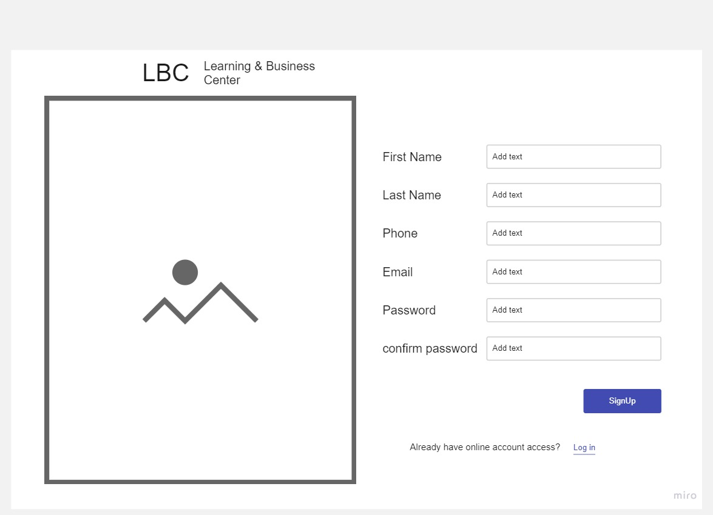
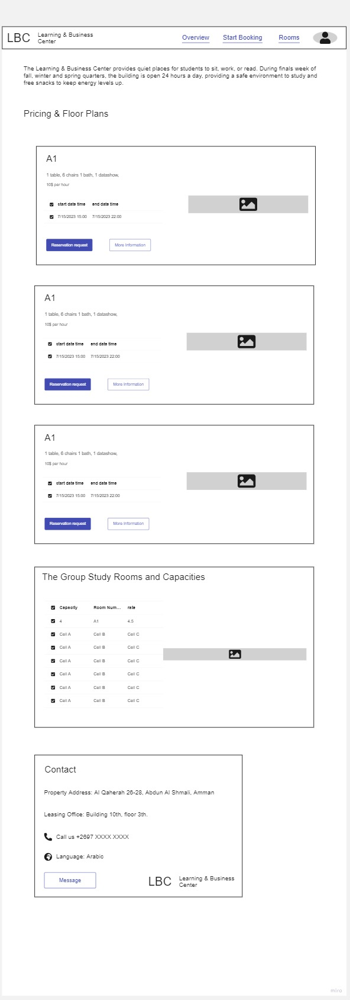
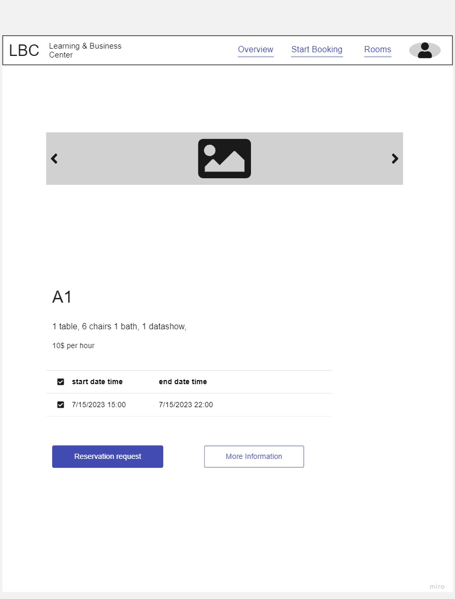
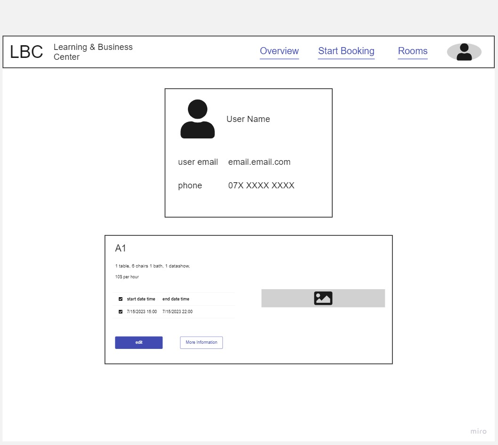
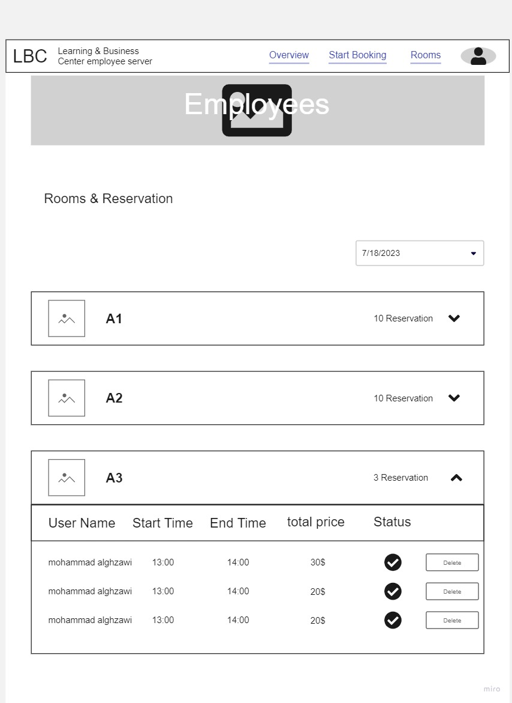

This is a [Next.js](https://nextjs.org/) project bootstrapped with [`create-next-app`](https://github.com/vercel/next.js/tree/canary/packages/create-next-app).

## Getting Started

First, run the development server:

```bash
npm run dev
# or
yarn dev
# or
pnpm dev
```

Open [http://localhost:3000](http://localhost:3000) with your browser to see the result.

You can start editing the page by modifying `app/page.tsx`. The page auto-updates as you edit the file.

This project uses [`next/font`](https://nextjs.org/docs/basic-features/font-optimization) to automatically optimize and load Inter, a custom Google Font.

## Learn More

To learn more about Next.js, take a look at the following resources:

- [Next.js Documentation](https://nextjs.org/docs) - learn about Next.js features and API.
- [Learn Next.js](https://nextjs.org/learn) - an interactive Next.js tutorial.

You can check out [the Next.js GitHub repository](https://github.com/vercel/next.js/) - your feedback and contributions are welcome!

## Deploy on Vercel

The easiest way to deploy your Next.js app is to use the [Vercel Platform](https://vercel.com/new?utm_medium=default-template&filter=next.js&utm_source=create-next-app&utm_campaign=create-next-app-readme) from the creators of Next.js.

Check out our [Next.js deployment documentation](https://nextjs.org/docs/deployment) for more details.


# project name: Study House

<br/>


## Author: mohammad alghzawi

<br/>


## How to initialize/run your application (where applicable)

1. pip install -r requirements.txt
2. python manage.py runserver

<br>

## Requirement Description

### overview

1. As a user, I want to be able to navigate between different pages.

1. As a user, I want to view for 3 or 4 rooms, title and description about study in our place.

1. As a user, I want a footer that provides additional information about the Study House, such as contact details or social media links.

### Start Booking

1. As a user, I want to be able to navigate between different rooms in the Study House. The navbar should provide easy access to each room's page.

1. As a user, I want to see a clear title and description for each room, giving me an overview of what I can expect from studying in that room.

1. As a user, I want to find the location and contact phone number for the Study House easily. This information should be readily available on the booking page.

- ### Room Page

1. As a user, I want to be able to add a new deal for a specific room. When I click on a room, a form should appear for me to fill out the booking details.

1. As a user, I want to see step-by-step instructions on how to add a new deal and book a room on the website. This should provide a clear guide for users who may be new to the platform.

1. As a user, I want to see the total amount of my current deal before submitting it. This will help me review and confirm the booking details.

### Employee Dashboard

1. As an employee, I want to have a dashboard where I can view all new deals submitted by users. This will allow me to review and process the bookings efficiently.

1. As an employee, I want to be able to add, update, and delete deals. This will give me control over the availability and details of the rooms.

### Admin Panel

1. As an admin, I want to have an admin panel where I can manage employees. This includes adding, updating, and deleting employee accounts. Additionally, I should have access to view all the deals and new deals on the platform.

1. As an admin, I want to be able to add, update, and delete rooms. This will give me control over the available spaces in the Study House.

# Minimum Viable Product (MVP)




# Databass




# Prototype

- ### Overview (landing page)

    Upon accessing the website, the user will be presented with an overview page designed to provide a comprehensive introduction to the website's concept. This page will feature a collection of sections aimed at acquainting the user with the core ideas and purpose of the website.

    


<br/>

- ### Overview

    Upon user registration, the user will be provided with the same overview page designed to provide a comprehensive introduction to the concept of the site, with the appearance of the contact us section and a picture of the profile.

    

<br/>

- ### start booking

    The user will be presented with a prominently displayed button that will seamlessly redirect them to the room page. This page outlines a straightforward, three-step process for easily renting an office space.

    


<br/>

- ### register

    To initiate the booking process, users have the option to register and create an account.

    
    

<br/>

- ### Rooms

    Within this webpage, users will encounter a selection of rooms accompanied by descriptive details, enabling them to choose the room. Additionally, users will have access to a building floor plan displaying the locations of the various rooms, enhancing their understanding of the layout.

    

<br/>

- ### Room

    Within this page, users will find comprehensive details pertaining to the room they have selected. They will have access to an array of information, allowing them to gain a deeper understanding of the room's features, amenities, and any additional relevant particulars.

    

<br/>

- ### userprofile

    Users will have the ability to view their profile, as well as the rooms they have booked, within the designated section of the website. This feature allows users to conveniently access and review their personal information and the details of their booked accommodations.

    


<br/>

## employees

- ### employees sign-in

    This page is exclusively accessible to employees for the purpose of registering as an employee.

    

<br/>


- ### reservation

    Employees are provided with the capability to access a comprehensive overview of all reservations made by users.

    


### Finalwork 8/8/2023 - Mohammad Alghzawi